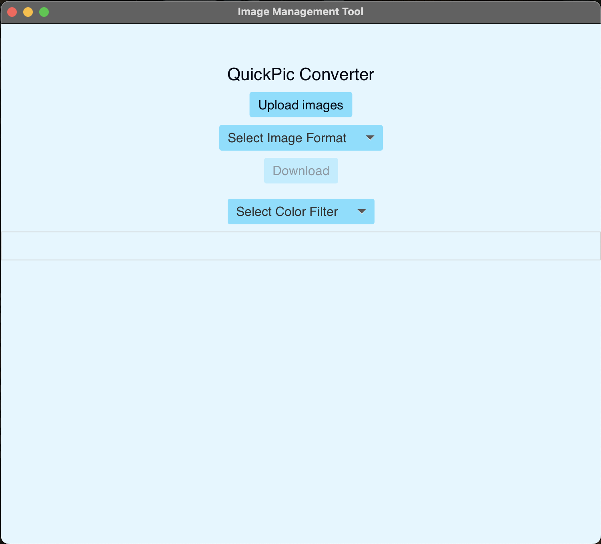

# 🖼️ Image Management Tool

A **JavaFX-powered desktop application** that simplifies image organization, conversion, and metadata inspection — built with strong Object-Oriented principles and clean UI design.

---

## ✨ Overview

This project demonstrates end-to-end desktop development with **JavaFX**, **ImageIO**, and optional **ImageMagick/JMagick** integration.  
It focuses on **intuitive image handling**, **efficient conversion**, and **clear code structure** backed by **design patterns**.

---

## 🚀 Features

### 🧭 Modern JavaFX GUI
- Upload image files from your local system  
- View 100×100 pixel thumbnails for quick previews  
- Display key image properties (height, width, camera info, GPS metadata, etc.)

### ⚙️ Image Processing & Conversion
- Convert images between multiple formats (JPEG, PNG, BMP, etc.)  
- Integration-ready with ImageIO / ImageMagick / JMagick  
- Download converted images directly within the app  

### 🧩 Design Patterns
- Implements at least one **design pattern** for modular and maintainable architecture  
- Encourages **separation of concerns** and clean component interaction  

### 🧱 Robust Object-Oriented Design
- Uses **inheritance**, **encapsulation**, and **interfaces** effectively  
- Clearly documented and easy to extend  

### 🖼️ Screenshot Gallery
- Contains test screenshots showing major features and scenarios  

### 🧯 Exception Handling & Documentation
- Graceful error handling  
- Clear inline comments and JavaDoc documentation  

### 🎨 (Optional) Filters & Effects
- Apply simple effects like grayscale, tints, or color filters *(if enabled)*  

---

## ⚡ Installation

1. **Clone the repository**
   ```bash
   git clone https://github.com/yourusername/Image-Management-Tool.git
2. Install Java (JDK 8+) and Maven
3. Build the project
4. mvn clean install
5. Run the application
   mvn javafx:run


💡 Usage
Launch the app and upload one or more images.
View image thumbnails and inspect metadata properties.
Choose the desired output format for conversion.
Optionally apply filters or effects.
Download processed images to your machine.


🧭 Project Structure
Path	Description
src/main/java	Main Java source code
TestScreenshots/	App and test screenshots
ClassDiagram.png	UML class diagram visualizing architecture
pom.xml	Maven configuration file


📸 Preview
(Add a few screenshot previews once uploaded)



🧠 Tech Stack
JavaFX — Modern desktop UI framework
ImageIO / ImageMagick / JMagick — Image manipulation and format conversion
Maven — Project build and dependency management
OOP Design — Inheritance, encapsulation, and interfaces


🪄 Highlights
🎨 Intuitive interface with real-time image previews
🧩 Design pattern implementation for maintainability
🧱 Scalable object-oriented architecture
💡 Demonstrates strong JavaFX and Java core concepts
